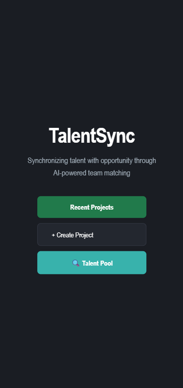
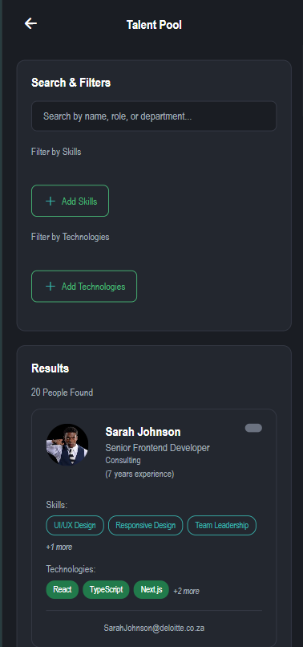
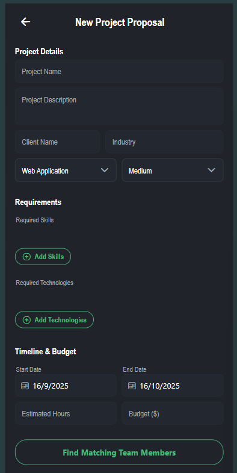
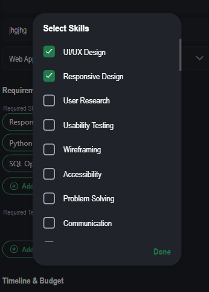
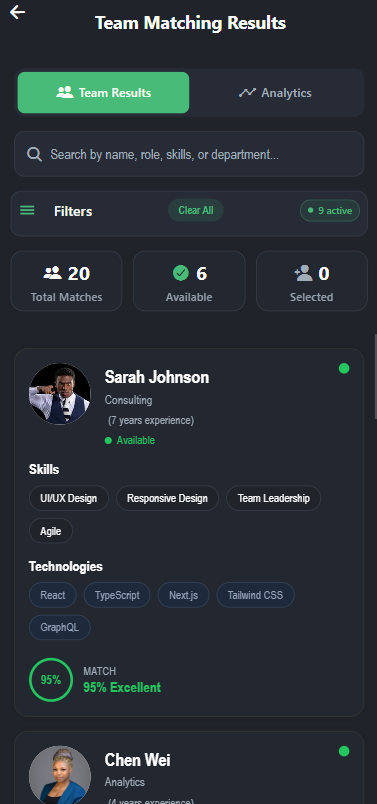
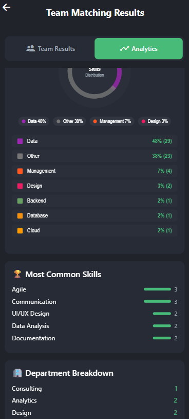

# TalentSync 🎯

*Synchronizing talent with opportunity through AI-powered team matching*

## Overview

TalentSync is a modern, AI-powered talent matching application designed to help project managers and HR professionals find the perfect team members for their projects. Built with React Native (Expo) and .NET Core, it provides intelligent employee-project matching based on skills, technologies, availability, and project requirements.


## 🚀 Key Features

### 🧠 **AI-Powered Matching**
- **Azure OpenAI Integration**: Leverages GPT models for intelligent skill analysis and matching
- **Smart Scoring Algorithm**: Provides percentage-based match scores for each employee
- **Skills & Technology Analysis**: Deep analysis of employee capabilities vs project requirements
- **Dynamic Filtering**: Real-time filtering based on match percentage, availability, and search criteria

### 🔍 **Advanced Search & Discovery**
- **Multi-Field Search**: Search across names, roles, departments, skills, and technologies
- **Auto-Complete Suggestions**: Smart suggestions based on available employee data
- **Debounced Search**: Optimized performance with 300ms search delay
- **Search Result Analytics**: Real-time result counting and filtering feedback

### 📊 **Real-Time Availability Tracking**
- **Project Status Monitoring**: Track who's available, on projects, or rolling off soon
- **Color-Coded Indicators**: 
  - 🟢 **Available** - Ready for new projects
  - 🟠 **Available Soon** - Projects ending within 2 months
  - 🔴 **On Project** - Currently assigned to long-term projects
- **Project Timeline Integration**: Automatic calculation based on project end dates

### 🎨 **Modern User Experience**
- **Professional Design**: Dark theme with clean, modern interface
- **Skeleton Loading States**: Professional loading animations instead of basic spinners
- **Responsive Cards**: Modern employee cards with avatars, skills, and availability
- **Progressive Disclosure**: Collapsible filters for clean interface
- **Mobile-First Design**: Optimized for mobile and tablet devices

### 📱 **Cross-Platform Compatibility**
- **React Native + Expo**: Native mobile experience on iOS and Android
- **Web Support**: Progressive Web App capabilities
- **Responsive Design**: Adapts to different screen sizes and orientations

## 🏗️ Architecture

### **Frontend Stack**
- **React Native** with Expo SDK 51+
- **TypeScript** for type safety
- **Expo Router** for file-based routing
- **Ionicons** for consistent iconography
- **React Hooks** for state management
- **Clean Architecture**: Modular component structure with unused components removed

### **Component Architecture**
```typescript
// Active Components (unused components removed for optimal codebase)
components/
├── CreateProposal.tsx          // Project creation form with skill/tech selection
├── SkillModal.tsx             // Reusable skill selection modal
├── TechnologyModal.tsx        // Reusable technology selection modal  
├── TeamMatchingResults.tsx    // AI-powered matching results display
├── TeamBuilderView.tsx        // Team assembly interface
├── SimpleAnalytics.tsx        // Analytics dashboard
├── themed-text.tsx           // Consistent text theming
├── themed-view.tsx           // Consistent view theming
├── haptic-tab.tsx            // Tab navigation with haptic feedback
└── ui/
    └── icon-symbol.tsx        // Reusable icon components

// Route-based Pages (app directory)
app/
├── (tabs)/
│   ├── index.tsx             // Three-button homepage
│   └── explore.tsx           // Analytics access
├── recent-projects.tsx        // Project listing with empty states
├── create-proposal.tsx        // Project creation wrapper
├── talent-pool.tsx           // Advanced employee search
├── team-matching-results.tsx  // AI matching interface
└── team-builder.tsx          // Team assembly tools
```

### **Backend Stack**
- **.NET 9.0** Core Web API
- **Entity Framework Core** for data access
- **SQL Server** database with LocalDB for development
- **Azure OpenAI** integration for AI matching
- **Dapper** for optimized database queries

### **Database Schema**
```sql
Employees Table:
- Id, Name, Email, Role, Department
- Skills, Technologies (comma-separated)
- ExperienceYears, Rating
- IsOnProject, CurrentProjectName, ProjectEndDate
- AvatarUrl for profile images
- Computed AvailabilityStatus property
```

## 📋 Core Functionalities

### **1. Three-Button Navigation Dashboard**
- **Recent Projects**: View and manage existing project portfolios with professional empty states
- **Create Project**: Direct access to proposal creation with comprehensive skill/technology selection
- **Talent Pool**: Advanced employee search and filtering with AI-powered matching capabilities
- **Consistent Design**: All buttons follow unified visual language with proper iconography

### **2. Comprehensive Talent Pool System**
```typescript
// Advanced talent search with multiple filters
{
  searchQuery: "React developer",
  selectedSkills: ["JavaScript", "React", "TypeScript"],
  selectedTechnologies: ["Node.js", "PostgreSQL", "Docker"],
  availabilityFilter: "available", // available, available-soon, on-project
  minExperience: 3,
  departments: ["Engineering", "Product"]
}
```

### **3. Enhanced Project Management**
- Create new project proposals with skill/technology requirements
- Define project scope, client details, and team needs
- Set priority levels and estimated timelines
- Professional empty state handling for no projects scenario

### **4. Intelligent Employee Profiles**
- Comprehensive employee profiles with skills matrix
- Real-time availability status updates with color coding
- Experience tracking and role management
- Photo/avatar support for team visualization
- Currency display in South African Rand (R) format

### **4. Advanced Filtering System**
- **Match Percentage Range**: Filter by AI match score (0-100%)
- **Availability Status**: Filter by current project status
- **Search Query**: Multi-field text search
- **Combined Filters**: Stack multiple filter criteria
- **One-Click Clear**: Reset all filters instantly

### **5. Team Building Workflow**
1. **Define Requirements**: Set project skills and technology needs
2. **AI Analysis**: System analyzes all employees against requirements
3. **Review Matches**: Browse ranked results with match percentages
4. **Filter & Search**: Narrow down candidates using advanced filters
5. **Team Selection**: Add members to project team
6. **Availability Check**: Ensure selected members are available

## 🎯 Use Cases

### **For Project Managers**
- **Resource Planning**: Find available talent for upcoming projects
- **Skill Gap Analysis**: Identify missing capabilities in potential teams
- **Timeline Planning**: Understand when team members will be available
- **Team Optimization**: Build balanced teams with complementary skills

### **For HR Professionals**
- **Talent Utilization**: Track employee project assignments and availability
- **Skill Inventory**: Maintain up-to-date employee capabilities database
- **Resource Allocation**: Optimize talent distribution across projects
- **Capacity Planning**: Forecast future availability and resource needs

### **For Team Leads**
- **Team Assembly**: Quickly find team members with required expertise
- **Skill Matching**: Ensure project requirements align with team capabilities
- **Availability Coordination**: Plan project timelines based on team availability

## 📊 Sample Data & Scenarios

The application includes realistic test data with **20 employees** across various departments:

### **Availability Distribution**
- **6 Available** (on the bench): Sarah, Lerato, Nomsa, Boitumelo, Chen, Wang
- **5 Available Soon** (Oct-Nov 2025): Thabo, Ayanda, Lindiwe, Sibusiso, Ngozi  
- **4 Medium Term** (Jan-Mar 2026): Zanele, Sipho, Kabelo, Tshepo
- **5 Long Term** (May-Sep 2026): Chinwe, Li Ming, Adebayo, Grace, Naledi

### **Department Coverage**
- **Engineering**: Frontend, Backend, Cloud, DevOps specialists
- **Data & Analytics**: Data Scientists, Business Analysts, Finance Analysts
- **Operations**: Project Managers, Scrum Masters, Operations Coordinators
- **Support Functions**: HR, Legal, Marketing, Security specialists

## 🔧 Technical Implementation

### **AI Matching Algorithm**
```csharp
// Enhanced matching logic with proper data handling
public async Task<List<EmployeeMatchResult>> MatchEmployeesAsync(MatchRequest request)
{
    // 1. Retrieve all employees from database
    // 2. Parse comma-separated skills/technologies to arrays
    var employees = await _context.Employees
        .Select(e => new EmployeeDto {
            Skills = e.Skills.Split(',').Select(s => s.Trim()).ToArray(),
            Technologies = e.Technologies.Split(',').Select(t => t.Trim()).ToArray()
        }).ToListAsync();
    
    // 3. Send parsed data to Azure OpenAI for analysis
    // 4. Receive AI analysis with match scores
    // 5. Combine employee data with AI scores
    // 6. Sort by match percentage (highest first)
    // 7. Apply availability and search filters
    // 8. Return ranked results with proper error handling
}
```

### **Advanced Search & Filtering**
```typescript
// Multi-field search with comprehensive filtering
const filterEmployees = (employees, filters) => {
  return employees.filter(employee => {
    // Text search across multiple fields
    const matchesSearch = !filters.searchQuery || [
      employee.name,
      employee.role, 
      employee.department,
      ...employee.skills,
      ...employee.technologies
    ].some(field => field.toLowerCase().includes(filters.searchQuery.toLowerCase()));
    
    // Skills filtering with safe array handling
    const matchesSkills = !filters.selectedSkills.length ||
      filters.selectedSkills.every(skill => 
        employee.skills.some(empSkill => 
          empSkill.toLowerCase().includes(skill.toLowerCase())
        )
      );
    
    // Availability status filtering
    const matchesAvailability = !filters.availabilityFilter ||
      employee.availabilityStatus === filters.availabilityFilter;
    
    return matchesSearch && matchesSkills && matchesAvailability;
  });
};
```

### **Search Implementation**
```typescript
// Multi-field search with debouncing
const filteredEmployees = employees.filter(emp => {
  const query = searchQuery.toLowerCase();
  return emp.name.toLowerCase().includes(query) || 
         emp.role.toLowerCase().includes(query) ||
         emp.skills.some(skill => skill.toLowerCase().includes(query)) ||
         emp.technologies.some(tech => tech.toLowerCase().includes(query));
});
```

### **Loading State Management**
- **Skeleton Screens**: Professional loading placeholders
- **Pulse Animations**: Smooth breathing animations during load
- **Progressive Loading**: Show UI structure while data loads
- **Error States**: Graceful handling of network issues

## 🚀 Getting Started

### **Prerequisites**
- Node.js 18+ and npm/yarn
- .NET 9.0 SDK
- SQL Server or LocalDB
- Azure OpenAI API access (optional for full AI features)
- Expo CLI for mobile development

### **Installation**

2. **Setup Backend**
```bash
cd backend
dotnet restore
dotnet ef database update
dotnet run
```

3. **Setup Frontend**
```bash
cd pa-app
npm install
npx expo start
```

4. **Database Setup**
```sql
-- Run migration scripts in backend/Migrations/
-- AddAvailabilityColumns.sql
-- UpdateCSVEmployeeAvailability.sql
-- FixNullAvailabilityFields.sql
```

### **Environment Configuration**
```bash
# pa-app/.env
API_URL=http://localhost:5214

# backend/appsettings.json
"ConnectionStrings": {
  "DefaultConnection": "Server=.\\LOCALDB;Database=PAApp;..."
}
```

## 📱 Application Flow & User Journey

### **🎯 App Workflow Diagram**

```
┌─────────────────────────────────────────────────────┐
│                HOME DASHBOARD                       │
│  ┌─────────────┐  ┌─────────────┐  ┌─────────────┐  │
│  │   RECENT    │  │   CREATE    │  │   TALENT    │  │ ← Three main navigation options
│  │  PROJECTS   │  │  PROJECT    │  │    POOL     │  │   with distinct visual design
│  │ (folder 📁) │  │  (plus ➕)  │  │ (search 🔍) │  │
│  └─────┬───────┘  └─────┬───────┘  └─────┬───────┘  │
└────────┼──────────────────┼──────────────────┼────────┘
         │                  │                  │
         ▼                  ▼                  ▼
┌─────────────────┐ ┌─────────────────┐ ┌─────────────────┐
│ RECENT PROJECTS │ │ NEW PROJECT     │ │ TALENT SEARCH   │
│    LISTING      │ │   PROPOSAL      │ │   & FILTERING   │
└─────────────────┘ └─────┬───────────┘ └─────────────────┘
                          │ Select project skills
                          ▼
┌─────────────────┐
│ NEW PROJECT     │ ← Define project requirements
│   PROPOSAL      │   • Project details (name, client)
└─────┬───────────┘   • Timeline & budget
      │ Select project skills
      ▼
┌─────────────────┐
│ SKILL SELECTION │ ← Choose required skills from list
│     MODAL       │   • UI/UX Design ✓
└─────┬───────────┘   • Responsive Design ✓
      │ Add skills    • User Research ✓
      ▼               • Wireframing ✓
┌─────────────────┐
│ TECHNOLOGY      │ ← Select required technologies
│  SELECTION      │   • Figma, React, Node.js, etc.
└─────┬───────────┘
      │ Find matching team
      ▼
┌─────────────────┐
│ TEAM MATCHING   │ ← AI-powered employee matching
│    RESULTS      │   • 20 Total matches found
└─────┬───────────┘   • 6 Available employees
      │ Switch to Analytics      • Match percentages (88% excellent)
      ▼
┌─────────────────┐
│ ANALYTICS       │ ← Visual insights & data analysis
│   DASHBOARD     │   • Skills distribution chart
└─────────────────┘   • Most common skills bar chart
                      • Team composition analytics
```

### **📸 Screen-by-Screen Walkthrough**

#### **1. 🏠 Home Dashboard - Three-Button Navigation**


**Features Shown:**
- **Three-Button Layout**: 
  - **Recent Projects** (green background, folder icon) - Side-by-side with Create Project
  - **Create Project** (dark background, plus icon) - Direct proposal creation access
  - **Talent Pool** (blue background, search icon) - Full-width talent search button
- **Professional Branding**: TalentSync logo with "Synchronizing talent with opportunity" tagline
- **Consistent Visual Design**: All buttons follow unified design language with proper icon positioning
- **Dark Theme UI**: Modern professional appearance suitable for enterprise use (#1A1D23 background)
- **Responsive Layout**: Buttons adapt to different screen sizes with proper flex layouts

**User Actions:**
- Tap "Recent Projects" to view existing project portfolio
- Tap "Create Project" for direct access to proposal creation
- Tap "Talent Pool" to access comprehensive employee search and filtering

#### **2. � Talent Pool - Advanced Search & Filtering**


**Features Shown:**
- **Comprehensive Search Bar**: Multi-field search across names, roles, skills, and technologies
- **Advanced Filtering Options**: Filter by skills, technologies, availability status, and experience
- **Employee Cards Layout**: Professional display with profile photos, roles, and key information
- **Real-time Results**: "20 Total Employees" with dynamic filtering and search results
- **Availability Indicators**: Clear visual status (Available, On Project, Available Soon)
- **Skills & Technology Tags**: Easy-to-read skill and technology badges for each employee
- **Search Suggestions**: Smart auto-complete and search recommendations
- **Filter Management**: "Clear All" option and active filter count display

**Advanced Search Capabilities:**
- Search across employee names, roles, departments, skills, and technologies
- Real-time filtering with debounced search (300ms delay for performance)
- Multiple filter criteria can be applied simultaneously
- Skills-based filtering with modal selection interface
- Technology stack filtering for precise matching
- Availability-based filtering (Available, Available Soon, On Project)

**User Actions:**
- Enter search terms to find specific employees or skills
- Apply skill filters using the dedicated Skills modal
- Apply technology filters using the Technologies modal
- Clear all filters with one-click "Clear All" button
- Browse employee profiles with detailed information cards
- View real-time availability status for resource planning

#### **3. �📝 New Project Proposal**


**Features Shown:**
- **Project Details Form**: Name, description, and client information
- **Timeline Planning**: Start date (16/9/2025) and end date (16/10/2025) pickers
- **Budget Management**: Estimated hours and budget fields
- **Skill Requirements**: Interactive skill selection with green add button
- **Technology Stack**: Separate technology selection area

**Current State:**
- Project partially filled with basic details
- Skills section shows "Add Skills" button ready for selection
- Technologies section shows "Add Technologies" button
- Timeline shows 1-month project duration

#### **4. ✅ Skills Selection Modal**


**Features Shown:**
- **Modal Overlay**: Clean popup interface for skill selection
- **Multi-Select Checkboxes**: Users can select multiple skills simultaneously
- **Pre-Selected Skills**: 
  - ✅ UI/UX Design (selected)
  - ✅ Responsive Design (selected)  
  - ✅ User Research (selected)
  - ✅ Wireframing (selected)
- **Additional Options**: Usability Testing, Accessibility, Problem Solving, Communication
- **Action Button**: "Done" button to confirm selections

**User Experience:**
- Intuitive checkbox interface for multiple selections
- Visual feedback with green checkmarks
- Clear action to complete selection process

#### **5. 👥 Team Matching Results**


**Features Shown:**
- **Results Summary**: "20 Total Matches, 6 Available, 0 Selected"
- **Employee Cards**: Professional layout with photos and details
- **Match Scoring**: "88% Excellent" match indicator with color coding
- **Employee Profiles**: 
  - Boitumelo Radebe (Design, 4 years experience, Available)
  - Li Ming (Design, 6 years experience, On Project - Global E-commerce Platform)
- **Skills Display**: Relevant skills shown as tags (User Research, Usability Testing, Wireframing)
- **Technology Stack**: Tech skills displayed (Figma, Miro, Sketch)
- **Action Buttons**: "Add" button to select team members

**Advanced Features:**
- Search functionality across names, roles, skills, departments
- Filter panel with "Clear All" option showing "10 active" filters
- Availability status indicators (green dot = available, red = on project)

#### **6. 📊 Analytics Dashboard**


**Features Shown:**
- **Skills Distribution Chart**: Circular chart showing skill category breakdown:
  - Data: 46% (29 people)
  - Other: 38% (23 people) 
  - Management: 7% (4 people)
  - Design: 3% (2 people)
  - Backend: 2% (1 person)
  - Database: 2% (1 person)
  - Cloud: 2% (1 person)

- **Most Common Skills Bar Chart**: Horizontal bars showing:
  - Agile (3 people)
  - Communication (3 people)
  - UI/UX Design (2 people)
  - API Development (2 people)
  - Documentation (2 people)

**Analytics Insights:**
- Clear visualization of team composition
- Skills gap analysis capability
- Data-driven team building decisions
- Resource allocation insights

### **🔄 Complete User Journey**

#### **Step 1: Project Initiation**
1. User opens TalentSync app to main dashboard
2. Views existing projects and their status
3. Identifies need for new project team
4. Taps floating "+" button to start project creation

#### **Step 2: Requirements Definition**
1. Fills in project details (name, client, timeline)
2. Sets project budget and estimated hours
3. Clicks "Add Skills" to define skill requirements
4. Selects relevant skills from comprehensive list
5. Adds required technologies for the project

#### **Step 3: AI-Powered Matching**
1. Taps "Find Matching Team Members" button
2. AI system analyzes all employees against requirements
3. System calculates match percentages using Azure OpenAI
4. Results page displays ranked employees with match scores

#### **Step 4: Team Selection & Analysis**
1. Reviews employee cards with detailed profiles
2. Uses search to filter by specific criteria
3. Applies availability filters to find free team members
4. Switches to Analytics tab for deeper insights
5. Views skills distribution and team composition data
6. Selects optimal team members using "Add" buttons

#### **Step 5: Decision Making**
1. Analyzes match percentages and availability
2. Considers project timeline against employee availability
3. Reviews skills distribution for balanced team
4. Makes informed decisions based on data and analytics
5. Builds final project team roster

### **🎯 Key User Experience Elements**

#### **Visual Design Principles**
- **Consistent Dark Theme**: Professional appearance across all screens
- **Color-Coded Status**: Green (available), Red (busy), intuitive indicators  
- **Clean Typography**: Arial Narrow font family for consistency
- **Card-Based Layout**: Modern, scannable information display
- **Progress Indicators**: Clear visual feedback for user actions

#### **Interaction Patterns**
- **Modal Overlays**: Non-intrusive selection interfaces
- **Floating Action Buttons**: Quick access to primary actions
- **Tab Navigation**: Easy switching between results and analytics
- **Search & Filter**: Powerful data discovery tools
- **One-Touch Actions**: Streamlined "Add" and "Done" buttons

#### **Information Architecture**
- **Progressive Disclosure**: Complex data revealed in logical steps
- **Contextual Actions**: Relevant buttons appear when needed
- **Status Communication**: Clear availability and project status
- **Data Hierarchy**: Important information prominently displayed
## 🔮 Future Enhancements

## 🏢 Enterprise Features

TalentSync is designed to scale from small teams to enterprise-level talent management:
- **Scalable Architecture**: Handles thousands of employees and projects
- **Performance Optimized**: Efficient database queries and caching
- **Security First**: Data encryption and secure API endpoints  
- **Audit Trail**: Complete activity logging and compliance features

---

**TalentSync** - *Where the right talent meets the right opportunity* 🎯

*Built with ❤️ using React Native, .NET Core, and Azure OpenAI*